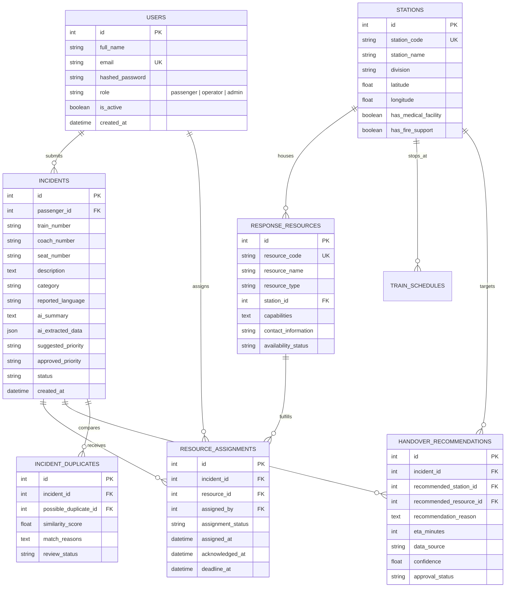

# RailResQ Database Schema Design

## Overview
RailResQ uses SQLAlchemy ORM with support for both PostgreSQL (production) and SQLite (zero-config demonstration).

```mermaid
erDiagram
    USERS ||--o{ INCIDENTS : submits
    USERS ||--o{ RESOURCE_ASSIGNMENTS : assigns
    STATIONS ||--o{ RESPONSE_RESOURCES : houses
    STATIONS ||--o{ TRAIN_SCHEDULES : stops_at
    STATIONS ||--o{ HANDOVER_RECOMMENDATIONS : targets
    INCIDENTS ||--o{ RESOURCE_ASSIGNMENTS : receives
    INCIDENTS ||--o{ HANDOVER_RECOMMENDATIONS : triggers
    INCIDENTS ||--o{ INCIDENT_DUPLICATES : compares
    RESPONSE_RESOURCES ||--o{ RESOURCE_ASSIGNMENTS : fulfills

    USERS {
        int id PK
        string full_name
        string email UK
        string hashed_password
        string role "passenger | operator | admin"
        boolean is_active
        datetime created_at
    }

    INCIDENTS {
        int id PK
        int passenger_id FK
        string train_number
        string coach_number
        string seat_number
        text description
        string category
        string reported_language
        text ai_summary
        json ai_extracted_data
        string suggested_priority
        string approved_priority
        string status
        datetime created_at
    }

    STATIONS {
        int id PK
        string station_code UK
        string station_name
        string division
        float latitude
        float longitude
        boolean has_medical_facility
        boolean has_fire_support
    }

    RESPONSE_RESOURCES {
        int id PK
        string resource_code UK
        string resource_name
        string resource_type
        int station_id FK
        text capabilities
        string contact_information
        string availability_status
    }

    RESOURCE_ASSIGNMENTS {
        int id PK
        int incident_id FK
        int resource_id FK
        int assigned_by FK
        string assignment_status
        datetime assigned_at
        datetime acknowledged_at
        datetime deadline_at
    }

    HANDOVER_RECOMMENDATIONS {
        int id PK
        int incident_id FK
        int recommended_station_id FK
        int recommended_resource_id FK
        text recommendation_reason
        int eta_minutes
        string data_source
        float confidence
        string approval_status
    }

    INCIDENT_DUPLICATES {
        int id PK
        int incident_id FK
        int possible_duplicate_id FK
        float similarity_score
        text match_reasons
        string review_status
    }
```
